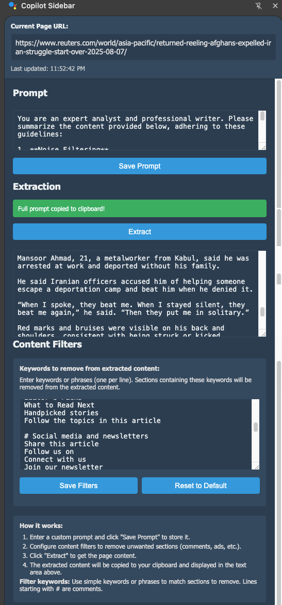

# Copilot Sidebar

A Chrome side panel extension that extracts the main content of webpages into clean, AI‑ready Markdown, optionally prepends your saved prompt, and copies the result to the clipboard. Includes a one‑key extract‑and‑copy command and an optional paragraph snipping helper.

## Features

- Clean Markdown extraction
  - Headings, paragraphs, lists, blockquotes, tables, and code blocks (with language fences when detectable).
  - Adds a simple context header (url, title, timestamp, breadcrumbs).
- Prompt composition
  - Save a custom prompt in the side panel; it’s prepended before the extracted content when copying.
- One‑key command
  - Press Alt+E to extract the current page and copy the saved prompt + content without opening the panel.
- Paragraph snipping (optional)
  - Injects subtle floating icons near long paragraphs; click to copy just that paragraph.
- Configurable content filtering
  - Remove boilerplate sections (e.g., “Read More”, comments, newsletter CTAs) via customizable keyword patterns.

## Screenshots

## Install (Load Unpacked)

1. Open Chrome → chrome://extensions/
2. Enable “Developer mode”
3. Click “Load unpacked” and select this folder

## Usage

- Open the side panel by clicking the extension icon.
- Enter a custom prompt and click “Save Prompt”.
- Click “Extract” to generate Markdown and copy “[your prompt]\n\n[extracted markdown]” to the clipboard.
- Or press Alt+E to extract‑and‑copy without opening the panel.
- Optional paragraph‑only copy: click the small icon that appears near long paragraphs on web pages.

## Content Filters

- In the side panel, list keywords/phrases (one per line) to remove matching sections from the output.
- Lines starting with “#” are comments.
- Use “Save Filters” or “Reset to Default”.

## Keyboard Shortcut

- Alt+E runs extract‑and‑copy from the current page (no panel needed).

## Permissions

- permissions: sidePanel, tabs, clipboardWrite, scripting, storage
- host_permissions: <all_urls>

## License

MIT