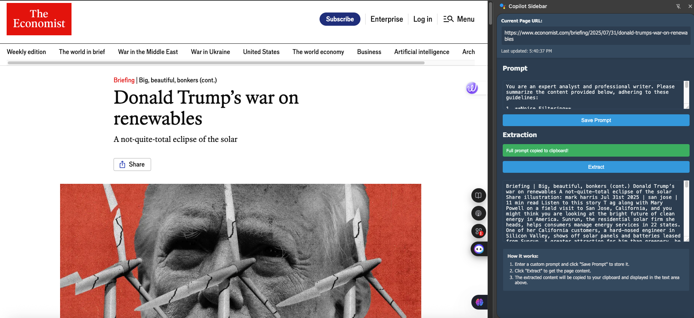
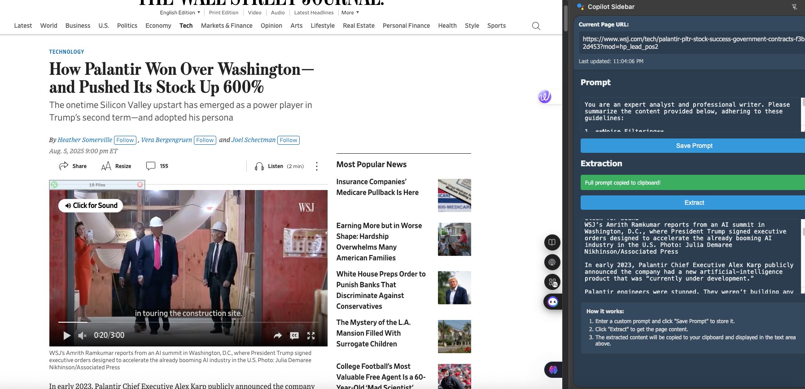
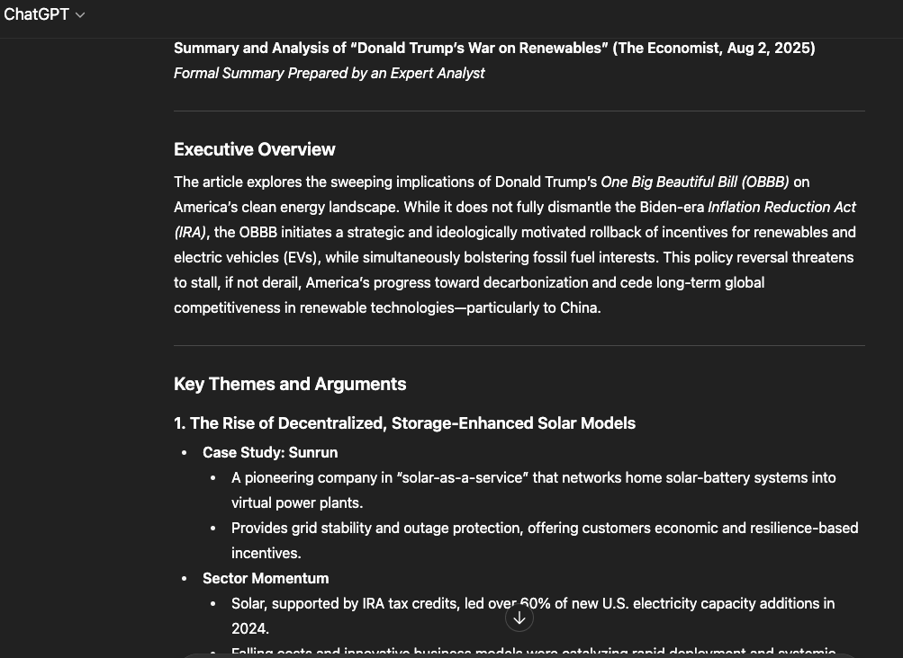

# Copilot Sidebar

A Chrome side panel extension to extract webpage content, combine it with your saved prompt, and copy the result to the clipboard.

## Screenshots

- Whole Page Extraction
  

- Article Only Extraction
  

- Summary
  

## Functional Overview

- Content extraction
  - Extracts main article content into clean Markdown with semantic chunking: headings, paragraphs, lists, code blocks, tables, and blockquotes.
  - Builds a YAML-like context header with url, title, timestamp, optional selection excerpt, and page breadcrumbs.
  - Respects user selection: if text is selected, extraction is scoped around the selected container.
- Prompt composition
  - Persist a custom prompt in chrome.storage and prepend it to extracted content before copying.
- Clipboard integration
  - Copies the combined prompt + extracted Markdown to clipboard automatically from the sidebar and via keyboard shortcut.
- Side panel UI
  - Dark-mode sidebar shows current URL/title, status, prompt editor, Extract button, and output preview.
- Keyboard shortcut
  - Alt+E triggers “extract and copy” from any page without opening the sidebar.
- Paragraph capture helpers
  - paragraph-icons.js can inject clickable icons next to paragraphs to send a single paragraph to the sidebar and clipboard.

## Quick Start (Load Unpacked)

1. Open Chrome → chrome://extensions/
2. Toggle “Developer mode”
3. Click “Load unpacked” and select this folder

## Usage

- Click the extension icon to open the side panel.
- Enter and Save Prompt.
- Click Extract to generate Markdown and copy prompt+content to clipboard.
- Or press Alt+E to extract-and-copy in place.

## Architecture

- Core files
  - manifest.json — MV3 manifest with side_panel, background service worker, commands, and permissions.
  - background.js — Handles side panel open, Alt+E command, extraction-trigger, clipboard write via in-page script, badge/notification cues, and auto-inject of paragraph-icons.
  - sidebar.html — Side panel UI.
  - sidebar.js — Panel logic: URL status, prompt persistence, invoke extraction via chrome.scripting, compose final prompt, clipboard write.
  - content-script.js — DOM-to-Markdown extractor with semantic chunking, context header, and content filtering.
  - paragraph-icons.js — Optional injected helper to capture single-paragraph text.
- Key Chrome APIs
  - chrome.sidePanel.setOptions()
  - chrome.action.onClicked.addListener()
  - chrome.tabs.query(), chrome.tabs.onActivated, chrome.tabs.onUpdated
  - chrome.storage.sync / chrome.storage.local
  - chrome.scripting.executeScript()
  - chrome.commands.onCommand
  - chrome.notifications.create()

## Permissions

- permissions: ["sidePanel","tabs","clipboardWrite","scripting","storage","notifications"]
- host_permissions: ["<all_urls>"]

## Notes

- The background service worker cannot access navigator.clipboard; clipboard writes are performed in-page via scripting injection.
- Extraction output is Markdown with a context header and basic filtering for non-article sections.

## License

MIT