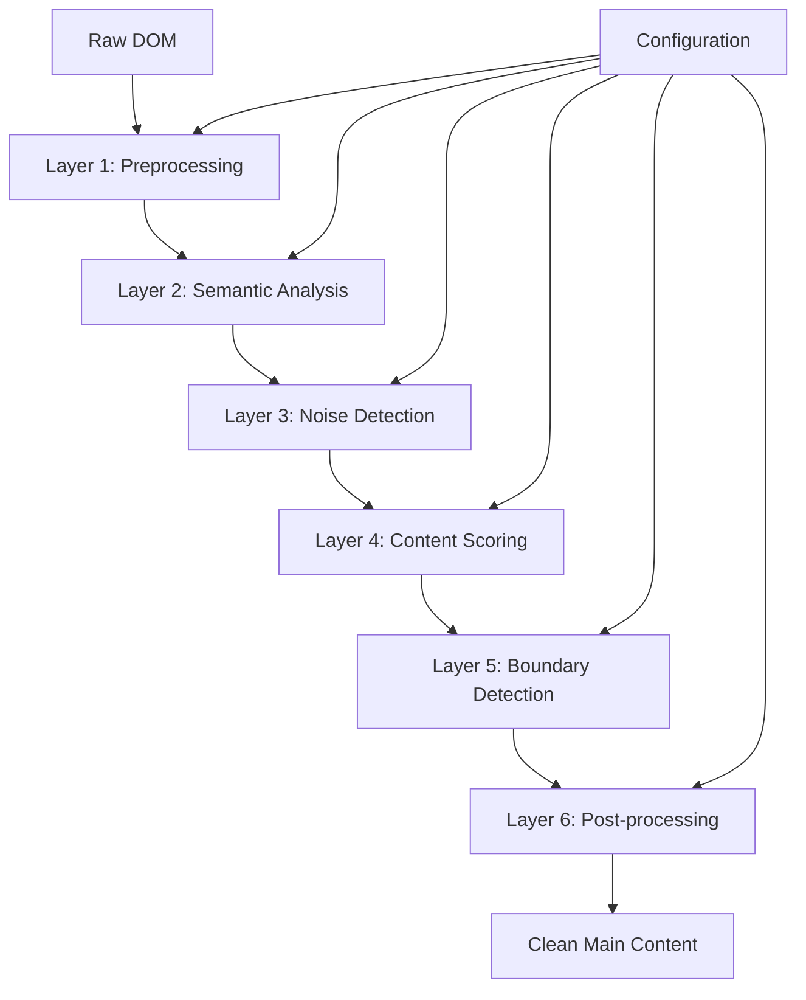

# Multi-Layered Content Filtering System Architecture

## System Overview

The content filtering system uses a pipeline approach with multiple layers, each responsible for a specific aspect of content analysis and filtering. This ensures robust content extraction while maintaining flexibility and maintainability.



## Layer 1: Preprocessing

**Purpose**: Clean and prepare the DOM for analysis

**Operations**:
- Remove hidden elements (`display: none`, `visibility: hidden`)
- Filter out script, style, and meta elements
- Normalize whitespace and text content
- Create element metadata (position, size, depth)

```javascript
class PreprocessingLayer {
  process(rootElement, config) {
    return {
      cleanedElements: this.removeHiddenElements(rootElement),
      elementMetadata: this.generateMetadata(rootElement),
      textNodes: this.extractTextNodes(rootElement)
    };
  }
  
  removeHiddenElements(element) {
    const walker = document.createTreeWalker(
      element,
      NodeFilter.SHOW_ELEMENT,
      {
        acceptNode: (node) => {
          if (this.isHidden(node) || this.isNonContentElement(node)) {
            return NodeFilter.FILTER_REJECT;
          }
          return NodeFilter.FILTER_ACCEPT;
        }
      }
    );
    // Implementation details...
  }
}
```

## Layer 2: Semantic Analysis

**Purpose**: Identify semantically meaningful content containers

**Analysis Types**:
- HTML5 semantic elements
- Schema.org markup
- Microdata and JSON-LD
- ARIA roles and landmarks

```javascript
class SemanticAnalysisLayer {
  process(preprocessedData, config) {
    const candidates = this.findSemanticCandidates(preprocessedData.cleanedElements);
    
    return candidates.map(element => ({
      element,
      semanticScore: this.calculateSemanticScore(element),
      semanticType: this.identifySemanticType(element),
      structuredData: this.extractStructuredData(element)
    }));
  }
  
  calculateSemanticScore(element) {
    let score = 0;
    
    // HTML5 semantic elements
    if (element.tagName.toLowerCase() === 'article') score += 0.8;
    if (element.tagName.toLowerCase() === 'main') score += 0.9;
    if (element.getAttribute('role') === 'main') score += 0.85;
    
    // Schema.org markup
    const itemType = element.getAttribute('itemtype');
    if (itemType && itemType.includes('Article')) score += 0.7;
    
    // Content-specific classes
    const className = element.className.toLowerCase();
    if (/article|content|post|entry/.test(className)) score += 0.5;
    
    return Math.min(score, 1.0);
  }
}
```

## Layer 3: Noise Detection

**Purpose**: Identify and filter out non-core content elements

**Detection Strategies**:
- Pattern-based filtering (class names, IDs, content patterns)
- Structural analysis (position, size, link density)
- Content analysis (promotional language, repetitive patterns)

```javascript
class NoiseDetectionLayer {
  constructor() {
    this.noisePatterns = {
      classNames: [
        /trending|popular|related|recommended/i,
        /sidebar|aside|widget|ad|advertisement/i,
        /social|share|comment|newsletter/i,
        /navigation|nav|menu|breadcrumb/i,
        /footer|header|banner|promo/i,
        /more-from|author-bio|tags|categories/i
      ],
      
      contentPatterns: [
        /^(trending|popular|related|more from)/i,
        /^(advertisement|sponsored|promoted)/i,
        /^(subscribe|newsletter|follow us)/i,
        /^(read more|continue reading)/i,
        /^(share this|like this)/i
      ],
      
      structuralIndicators: {
        highLinkDensity: 0.3,  // >30% of content is links
        shortTextFragments: 50, // Average text length < 50 chars
        promotionalStyling: ['uppercase', 'bold', 'large-font']
      }
    };
  }
  
  process(semanticCandidates, config) {
    return semanticCandidates.map(candidate => ({
      ...candidate,
      noiseScore: this.calculateNoiseScore(candidate.element),
      noiseReasons: this.identifyNoiseReasons(candidate.element),
      isNoise: this.isNoiseElement(candidate.element, config.noiseThreshold)
    }));
  }
  
  calculateNoiseScore(element) {
    let noiseScore = 0;
    
    // Class/ID pattern matching
    noiseScore += this.checkPatterns(element);
    
    // Structural analysis
    noiseScore += this.analyzeStructure(element);
    
    // Content analysis
    noiseScore += this.analyzeContent(element);
    
    // Position analysis
    noiseScore += this.analyzePosition(element);
    
    return Math.min(noiseScore, 1.0);
  }
}
```

## Layer 4: Content Scoring

**Purpose**: Score content quality using multiple factors

**Scoring Factors**:
- Text quality (readability, structure, coherence)
- Content density (text-to-HTML ratio)
- Article structure (headlines, paragraphs, proper hierarchy)
- Metadata presence (author, date, tags)

```javascript
class ContentScoringLayer {
  constructor() {
    this.weights = {
      textQuality: 0.25,
      contentDensity: 0.20,
      articleStructure: 0.20,
      semanticScore: 0.15,
      positionScore: 0.10,
      metadataScore: 0.10
    };
  }
  
  process(filteredCandidates, config) {
    return filteredCandidates
      .filter(candidate => !candidate.isNoise)
      .map(candidate => ({
        ...candidate,
        contentScore: this.calculateContentScore(candidate),
        qualityMetrics: this.analyzeQuality(candidate.element)
      }))
      .sort((a, b) => b.contentScore - a.contentScore);
  }
  
  calculateContentScore(candidate) {
    const metrics = {
      textQuality: this.analyzeTextQuality(candidate.element),
      contentDensity: this.calculateContentDensity(candidate.element),
      articleStructure: this.analyzeArticleStructure(candidate.element),
      semanticScore: candidate.semanticScore,
      positionScore: this.analyzePosition(candidate.element),
      metadataScore: this.analyzeMetadata(candidate.element)
    };
    
    let totalScore = 0;
    for (const [metric, value] of Object.entries(metrics)) {
      totalScore += value * this.weights[metric];
    }
    
    // Apply noise penalty
    totalScore *= (1 - candidate.noiseScore * 0.5);
    
    return Math.max(0, Math.min(1, totalScore));
  }
}
```

## Layer 5: Boundary Detection

**Purpose**: Determine precise content boundaries within selected elements

**Boundary Types**:
- Natural content boundaries (article end markers)
- Structural boundaries (related content sections)
- Visual boundaries (layout changes, styling differences)

```javascript
class BoundaryDetectionLayer {
  process(scoredCandidates, config) {
    const bestCandidate = scoredCandidates[0];
    if (!bestCandidate) return null;
    
    return {
      element: bestCandidate.element,
      boundaries: this.detectBoundaries(bestCandidate.element),
      contentRegions: this.identifyContentRegions(bestCandidate.element),
      trimmedContent: this.trimToMainContent(bestCandidate.element)
    };
  }
  
  detectBoundaries(element) {
    const boundaries = [];
    
    // Look for explicit boundary markers
    const endMarkers = element.querySelectorAll(
      '.article-end, .content-end, .story-end, [data-module="ArticleEndSlot"]'
    );
    boundaries.push(...endMarkers);
    
    // Look for related content sections
    const relatedSections = element.querySelectorAll(
      '.related-articles, .more-stories, .recommended, .trending'
    );
    boundaries.push(...relatedSections);
    
    // Look for comment sections
    const commentSections = element.querySelectorAll(
      '.comments, .comment-section, #comments, [data-module="Comments"]'
    );
    boundaries.push(...commentSections);
    
    return boundaries.sort((a, b) => 
      this.getElementPosition(a) - this.getElementPosition(b)
    );
  }
}
```

## Layer 6: Post-processing

**Purpose**: Final cleanup and optimization of extracted content

**Operations**:
- Remove empty elements and whitespace
- Normalize text formatting
- Preserve important structural elements
- Apply final quality checks

```javascript
class PostProcessingLayer {
  process(boundaryResult, config) {
    if (!boundaryResult) return null;
    
    const cleanedContent = this.cleanContent(boundaryResult.trimmedContent);
    const optimizedContent = this.optimizeStructure(cleanedContent);
    
    return {
      mainContent: optimizedContent,
      metadata: this.extractFinalMetadata(optimizedContent),
      qualityScore: this.calculateFinalQuality(optimizedContent),
      extractionMethod: this.getExtractionMethod(boundaryResult)
    };
  }
  
  cleanContent(element) {
    // Remove empty paragraphs
    const emptyPs = element.querySelectorAll('p:empty, p:not(:has(*)):not(:has(text()))');
    emptyPs.forEach(p => p.remove());
    
    // Normalize whitespace
    const textNodes = this.getTextNodes(element);
    textNodes.forEach(node => {
      node.textContent = node.textContent.replace(/\s+/g, ' ').trim();
    });
    
    // Remove redundant wrapper elements
    this.unwrapRedundantElements(element);
    
    return element;
  }
}
```

## Configuration System

**Extraction Modes**:

```javascript
const FILTERING_CONFIGS = {
  strict: {
    semanticThreshold: 0.7,
    noiseThreshold: 0.3,
    minContentScore: 0.8,
    requireBoundaries: true,
    aggressiveFiltering: true
  },
  
  balanced: {
    semanticThreshold: 0.5,
    noiseThreshold: 0.5,
    minContentScore: 0.6,
    requireBoundaries: false,
    aggressiveFiltering: false
  },
  
  comprehensive: {
    semanticThreshold: 0.3,
    noiseThreshold: 0.7,
    minContentScore: 0.4,
    requireBoundaries: false,
    aggressiveFiltering: false
  }
};
```

## Error Handling and Fallbacks

**Fallback Chain**:
1. **Primary**: Full multi-layer processing
2. **Secondary**: Skip boundary detection, use top-scored candidate
3. **Tertiary**: Use semantic analysis only with basic noise filtering
4. **Emergency**: Fall back to current length-based approach

```javascript
class ContentFilteringPipeline {
  async process(rootElement, config = 'balanced') {
    try {
      // Primary approach: full pipeline
      return await this.runFullPipeline(rootElement, config);
    } catch (error) {
      console.warn('Full pipeline failed, trying fallback:', error);
      
      try {
        // Secondary: skip boundary detection
        return await this.runSimplifiedPipeline(rootElement, config);
      } catch (error) {
        console.warn('Simplified pipeline failed, trying basic:', error);
        
        // Tertiary: basic semantic + noise filtering
        return this.runBasicExtraction(rootElement, config);
      }
    }
  }
}
```

## Performance Considerations

**Optimization Strategies**:
- Lazy evaluation of expensive operations
- Caching of computed styles and positions
- Early termination when high-confidence candidates are found
- Parallel processing of independent analysis tasks

**Memory Management**:
- Clean up temporary DOM modifications
- Release references to large DOM trees
- Use WeakMap for element metadata storage

This multi-layered architecture provides robust content extraction while maintaining flexibility and performance. Each layer can be independently configured and optimized based on specific requirements and site characteristics.